<a href="https://ladunjexa.vercel.app/work/contact">
    <picture>
        <source media="(prefers-color-scheme: dark)" srcset="./header-dark.svg">
        <source media="(prefers-color-scheme: light)" srcset="./header.svg" />
        
    </picture>
</a>

<header>
    

        
        
        <!--      -->
        
        <!--      -->
    

</header>

 
 

    

        <h2>📊 Statistics</h2>
    

     
    

        
          
        
        
          
        
        

